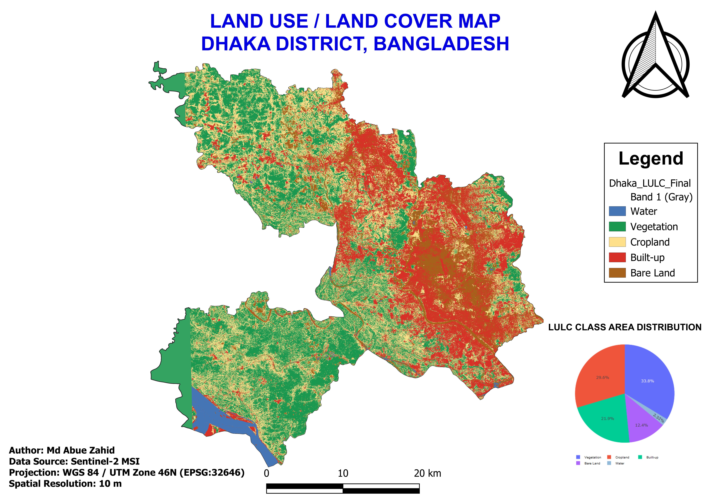

# 🛰️ Land Use / Land Cover (LULC) Mapping of Dhaka District


## 📍 Project Overview

This project presents a **Land Use / Land Cover (LULC) classification of Dhaka District, Bangladesh**, developed using Sentinel-2 multispectral satellite imagery and QGIS.

The main objective of this project was to identify and visualize major land cover classes across Dhaka District using multispectral satellite data and spectral indices.

The final classification contains five major LULC classes:

- 💧 Water
- 🌳 Vegetation
- 🌾 Cropland
- 🏙️ Built-up
- 🟫 Bare Land

This project demonstrates a complete GIS and remote sensing workflow, from satellite data preparation and preprocessing to spectral index calculation, classification, area analysis, visualization, and professional map production.

---

## 🗺️ Final LULC Map



---

## 📊 LULC Area Distribution

The classified raster was analyzed to estimate the spatial distribution of each LULC class.


### LULC Classes

| Class | Description |
|---|---|
| 1 | Water |
| 2 | Vegetation |
| 3 | Cropland |
| 4 | Built-up |
| 5 | Bare Land |

---

## 🛰️ Data Source

### Sentinel-2 MSI

Sentinel-2 multispectral satellite imagery was used as the primary remote sensing dataset.

The following bands were used:

| Band | Resolution | Purpose |
|---|---:|---|
| B02 – Blue | 10 m | Spectral analysis |
| B03 – Green | 10 m | Water and vegetation analysis |
| B04 – Red | 10 m | Vegetation analysis |
| B08 – NIR | 10 m | Vegetation analysis |
| B11 – SWIR | 20 m | Built-up and moisture analysis |

The 20 m SWIR data were aligned with the 10 m imagery before further analysis.

---

## 🔬 Methodology

The project followed the workflow below:

### 1. Satellite Data Preparation

Sentinel-2 satellite imagery covering Dhaka District was collected and prepared for analysis.

### 2. CRS Preparation

The datasets were projected to:

**WGS 84 / UTM Zone 46N**

**EPSG:32646**

This projected coordinate system was used for spatial analysis using metric units.

### 3. Image Alignment

The satellite raster layers were aligned to maintain consistent:

- CRS
- Pixel size
- Extent
- Grid alignment

### 4. Cloud Masking

Cloud and unwanted pixels were removed using a cloud mask before performing spectral analysis.

### 5. Spectral Index Calculation

Three major spectral indices were calculated.

#### NDVI — Normalized Difference Vegetation Index

```text
NDVI = (NIR - Red) / (NIR + Red)
