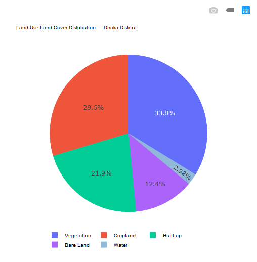

README.md
# 🛰️ Land Use / Land Cover (LULC) Mapping of Dhaka District, Bangladesh
| 1 | 💧 Water | 32.972 | 2.3% |
| 2 | 🌳 Vegetation | 480.729 | 33.8% |
| 3 | 🌾 Cropland | 422.014 | 29.6% |
| 4 | 🏙️ Built-up | 311.851 | 21.9% |
| 5 | 🟫 Bare Land | 176.021 | 12.4% |
| | **Total Classified Area** | **1,423.587** | **100%** |


> **Note:** Percentages are calculated from the classified pixels in the final LULC raster. NoData pixels were excluded from the area calculation.


---


# 🥧 LULC Area Distribution Chart


A pie chart was created using **DataPlotly in QGIS** to visualize the relative contribution of each LULC class.


<p align="center">
  
</p>


---


# 🛰️ Data Source


## Sentinel-2 MSI


Sentinel-2 multispectral satellite imagery was used as the primary dataset for this project.


The following Sentinel-2 spectral bands were used:


| Band | Wavelength Region | Native Resolution | Main Use |
|---|---|---:|---|
| B02 | Blue | 10 m | Spectral analysis |
| B03 | Green | 10 m | Water and vegetation analysis |
| B04 | Red | 10 m | Vegetation analysis |
| B08 | Near Infrared (NIR) | 10 m | Vegetation analysis |
| B11 | Short-Wave Infrared (SWIR) | 20 m | Built-up and moisture analysis |


The 20 m SWIR band was aligned with the 10 m imagery before performing further analysis.


---


# 🔬 Methodology


The overall workflow followed these major stages:


```text
Sentinel-2 Data
       ↓
Study Area Preparation
       ↓
CRS & Raster Alignment
       ↓
Cloud Masking
       ↓
Band Preparation
       ↓
NDVI / NDWI / NDBI
       ↓
Spectral Information Integration
       ↓
LULC Classification
       ↓
Class Area Calculation
       ↓
Cartographic Visualization
       ↓
Final LULC Map
1. Study Area Preparation

The Dhaka District boundary was prepared and used to define the analysis area.

The satellite imagery was subsequently clipped to the study area.

2. Coordinate Reference System

The analysis was performed using:

WGS 84 / UTM Zone 46N

EPSG:32646

The projected coordinate system provides measurements in meters, making it suitable for raster area calculations and spatial analysis.

3. Raster Alignment

The satellite raster datasets were aligned to maintain consistent:

Coordinate Reference System
Pixel size
Raster extent
Grid alignment

This step was particularly important because Sentinel-2 bands have different native spatial resolutions.

4. Cloud Masking

Cloud and unwanted pixels were identified and excluded from the analysis using a cloud mask.

This helped reduce the influence of cloud-covered areas on the spectral analysis and final classification.

5. Spectral Index Calculation

Three major spectral indices were calculated.

NDVI — Normalized Difference Vegetation Index
NDVI = (NIR - Red) / (NIR + Red)

NDVI was used to identify and characterize vegetation.

NDWI — Normalized Difference Water Index
NDWI = (Green - NIR) / (Green + NIR)

NDWI was used to support the identification of water-related areas.

NDBI — Normalized Difference Built-up Index
NDBI = (SWIR - NIR) / (SWIR + NIR)

NDBI was used to support the identification of built-up surfaces.

📈 Spectral Index Statistics

The calculated raster statistics were:

Index	Minimum	Maximum
NDVI	-0.0998	0.6047
NDWI	-0.5726	0.1548
NDBI	-0.4988	1.0000

These indices were used as supporting spectral information for differentiating the major land-cover categories.

🧩 LULC Classification Scheme

The final classification contains five classes.

Class ID	Class Name	Description
1	Water	Rivers, ponds, lakes and other water surfaces
2	Vegetation	Trees, forests and other vegetated surfaces
3	Cropland	Agricultural and cultivated areas
4	Built-up	Buildings, settlements, roads and other impervious surfaces
5	Bare Land	Exposed soil and other sparsely vegetated surfaces
📐 Raster Statistics

The final classified raster contains:

Parameter	Value
Raster Width	5,175 pixels
Raster Height	5,817 pixels
Spatial Resolution	10 × 10 m
Total Pixel Count	30,102,975
NoData Pixel Count	15,867,110
CRS	EPSG:32646
Pixel Area	100 m²

The classified land-cover area was calculated from the valid classified pixels.

📊 Classification Area Calculation

For a 10 m × 10 m raster:

Pixel Area = 10 × 10
           = 100 m²

Therefore:

Class Area = Number of Class Pixels × 100 m²

Area was subsequently converted to square kilometres:

Area (km²) = Area (m²) / 1,000,000
🛠️ Software & Tools

The project was developed using:

QGIS
GDAL
Raster Calculator
DataPlotly
QGIS Print Layout
📁 Repository Structure
dhaka-district-lulc/
│
├── classification/
│   └── Dhaka_LULC_Final.tif
│
├── output/
│   ├── Dhaka_LULC_Final_Map.png
│   ├── Dhaka_LULC_Final_Map.pdf
│   └── LULC_Pie_Chart.png
│
├── documentation/
│   └── methodology.md
│
├── screenshots/
│
├── Dhaka_LULC.qgz
└── README.md
📦 Project Outputs

The main outputs of this project include:

🗺️ Final LULC Map

A professionally designed map showing the spatial distribution of five LULC classes across Dhaka District.

📊 LULC Area Statistics

Quantification of the area occupied by each LULC class.

🥧 Area Distribution Chart

A pie chart showing the relative percentage of each LULC category.

🗃️ Classified Raster

A categorical raster representing the final LULC classification.

🎯 Key Skills Demonstrated

This project demonstrates practical experience in:

Remote sensing
Sentinel-2 multispectral data processing
Raster preprocessing
CRS management
Raster alignment
Cloud masking
Raster Calculator
NDVI calculation
NDWI calculation
NDBI calculation
LULC classification
Raster statistics
Area calculation
Spatial data visualization
QGIS cartography
Map layout design
DataPlotly visualization
GIS project documentation
⚠️ Limitations

The results of this project should be considered an educational and portfolio-level LULC classification rather than a validated operational land-cover product.

Potential sources of uncertainty include:

Spectral similarity between different land-cover types
Mixed pixels
Cloud and atmospheric effects
Seasonal variation in vegetation and cropland
Resolution differences between Sentinel-2 bands
Classification threshold selection
Absence of extensive field-based ground-truth validation

Therefore, the classification should be interpreted with appropriate consideration of these limitations.

🚀 Future Improvements

Future versions of this project could include:

Ground-truth data collection
Accuracy assessment
Confusion matrix
Overall accuracy calculation
Kappa coefficient
Random Forest classification
Multi-temporal Sentinel-2 analysis
LULC change detection
Additional spectral indices
Automated classification workflow
📚 Project Purpose

This project was developed as part of a GIS and Remote Sensing portfolio to demonstrate practical skills in satellite image processing, raster analysis, LULC classification and professional cartographic design.

👤 Author
Abue Zahid

GIS & Remote Sensing Enthusiast

This project represents practical work in:

GIS | Remote Sensing | QGIS | Satellite Image Analysis | LULC Mapping

📄 License & Attribution

This project is intended for educational and portfolio purposes.

The satellite imagery and related datasets remain subject to their respective data providers' terms and licenses.

If you reuse the derived maps, analysis or documentation, please provide appropriate attribution.

⭐ Acknowledgement

Special acknowledgement to the open geospatial and remote sensing community and the developers of QGIS for providing powerful tools for geospatial analysis and visualization.
